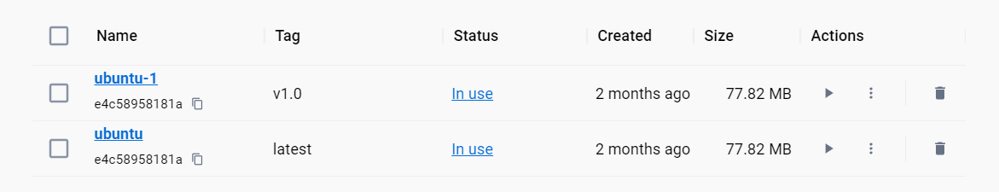

# 一 Docker

## 1 docker 四大核心技术

1. IMAGE 镜像
2. CONTAINER 容器
3. DATA VOlUMES 数据卷
4. NETWORK 网络


## 2 结构

1.  Docker客户端(Docker Client)

   ​	Docker客户端(Docker Client)是用户与Docker进行交互的最主要方式。当在终端输入docker命令时，对应的就会 在服务端产生对应的作用，并把结果返回给客户端。Docker Client除了连接本地服务端，通过更改或指定 DOCKER_HOST连接远程服务端。 

2. Docker服务端(Docker Server)

   ​	Docker Daemon其实就是Docker 的服务端。它负责监听Docker API请求(如Docker Client)并管理Docker对象 如镜像、容器、网络、数据卷等

3. Docker Registries

   ​	俗称Docker仓库，专门用于存储镜像的云服务环境. 

   Docker Hub就是一个公有的存放镜像的地方，类似Github存储代码文件。同样的也可以类似Github那样搭建私有 的仓库。 

4. Docker 对象(Docker Objects)

   镜像：一个Docker的可执行文件，其中包括运行应用程序所需的所有代码内容、依赖库、环境变量和配置文件 等。 

   容器：镜像被运行起来后的实例。 

   网络：外部或者容器间如何互相访问的网络方式，如host模式、bridge模式。 

   数据卷：容器与宿主机之间、容器与容器之间共享存储方式，类似虚拟机与主机之间的共享文件目录。


## 3 特点

### 1 三大理念： 

构建：龙珠里的胶囊，将你需要的场景构建好，装在一个小胶囊里 

运输：随身携带着房子、车子等，非常方便 

运行：只需要你轻轻按一下胶囊，找个合适的地方一放，就ok了 

### 2 优点

 多： 适用场景多 

快： 环境部署快、更新快 

好： 好多人在用 

省： 省钱省力省人工 

### 3 缺点 

太腻歪人： 依赖操作系统 

不善沟通： 依赖网络 

不善理财： 银行U盾等场景不能用

# 二 基本操作

## 1 基本格式 

systemctl [参数] docker 

参数 :

start 开启服务 stop 关闭 restart 重启 status 状态 

## 2 镜像管理

​	镜像是一个Docker的可执行文件，其中包括运行应用程序所需的所有代码内容、依赖库、环 境变量和配置文件等。 通过镜像可以创建一个或多个容器。 

### 1 搜索

```
docker search ubuntu
```


### 2 拉取

```
docker pull ubuntu
```


### 3 查看

```
docker images
docker ubuntu
```


### 4 重命名

```
docker tag ubuntu:latest ubuntu-1:v1.0
```




### 5 删除

```
docker rmi[参数][镜像]
-f 强制
```


指向相同镜像的需要指定名称

单个可以指定ID

### 6 导出 导入

#### 1 导出

将本地的镜像打包成本地压缩包

```
 docker save -o ubuntu-2 ubuntu
```

#### 2 导入

```
docker load --input ubuntu-2.tar
cat ubuntu11.tar.gz | docker import - ubuntu-cat
```


### 7 镜像详情

```
docker history ubuntu:latest
```


```
docker inspect ubuntu
```


# 三 容器

```
CONTAINER ID   IMAGE     COMMAND   CREATED   STATUS    PORTS     NAMES			
```

容器id-- 依赖哪个镜像启动--是否有默认启动命令--多久之前创建--是否启动--端口--容器名称			  

## 1 创建一个待启动的容器

```
#作用：
利用镜像创建出一个Created 状态的待启动容器
#命令格式：
docker create [OPTIONS] IMAGE [COMMAND] [ARG...]
docker create [参数命令] 依赖镜像 [容器内命令] [命令参数]
#命令参数(OPTIONS)：查看更多
-t, --tty 分配一个伪TTY，也就是分配虚拟终端
-i, --interactive 即使没有连接，也要保持STDIN打开
--name 为容器起名，如果没有指定将会随机产生一个名称
#命令参数（COMMAND\ARG）:
COMMAND 表示容器启动后，需要在容器中执行的命令，如ps、ls 等命令
ARG 表示执行 COMMAND 时需要提供的一些参数，如ps 命令的 aux、ls命令的-a等等
#创建容器（附上ls命令和a参数）
docker create -it --name ubuntu-1 ubuntu ls -a
```


## 2 启动

```
docker start -a id
```


## 3 创建并且启动

```
#作用：
利用镜像创建并启动一个容器
#命令格式：
docker run [命令参数] [镜像名称][执行的命令]
命令参数(OPTIONS)：
-t, --tty 分配一个伪TTY，也就是分配虚拟终端
-i, --interactive 即使没有连接，也要保持STDIN打开
--name 为容器起名，如果没有指定将会随机产生一个名称
-d, --detach 在后台运行容器并打印出容器ID
--rm 当容器退出运行后，自动删除容器

#启动一个镜像输出内容并删除容器
$ docker run --rm --name nginx1 nginx /bin/echo "hello docker"
```


##  4 暂停和取消暂停

```
docker pause id
```


```
docker unpause id
```

## 5 重启

```
docker restart -t int id
```

## 6 关闭 终止 删除

关闭:**死缓**

```
docker stop id -a
```


终止:强制并且立即关闭一个或者多个处于暂停状态或者运行状态的容器(**死刑立即执行**)

```
docker kill id
```

删除容器有三种方法： 正常删除 -- 删除已关闭的 强制删除 -- 删除正在运行的 强制批量删除 -- 删除全部的容器 

```
docker rm id
```

```
docker rm -f id
```

```
docker rm -f $(docker ps -a -q)
#按照执行顺序$（）， 获取到现在容器的id然后进行删除
```


## 7 进入与退出

### 1 进入

```

```


手动进入

```
docker exec -it name /bin/bash
```


### 2 退出

```
ctrl+d
```

## 8 重命名

```
docker rename id newname
```

### 9 容器详细

```
docker inspect id
```

### 10 容器端口

```
docker port id
```

# 四 基于容器创建镜像

## 1 创建

```
docker commit -m "mkdir hello" -a "qjy" 56837af4f2bb qjy-ubuntu:v1
```


```
docker export id > name.tar
```

```
导出（export）  导入（import）  保存（save）  加载（load）区别
import与load的区别：
import可以重新指定镜像的名字，load不可以
export 与 保存 save 的区别：
1、export导出的镜像文件大小，小于 save保存的镜像。
2、export 导出（import导入）是根据容器拿到的镜像，再导入时会丢失镜像所有的历史。
```

# 五 数据管理

**数据卷**

就是将宿主机的某个目录，映射到容器中，作为数据存储的目录，我们就可以在宿主机对数据进行存储 

数据卷（Data Volumes）：容器内数据直接映射到本地主机环境 

**数据卷特性** 

1、数据卷可以在容器之间共享和重用，本地与容器间传递数据更高效； 

2、对数据卷的修改会立马有效，容器内部与本地目录均可； 

3、对数据卷的更新，不会影响镜像，对数据与应用进行了解耦操作； 

4、卷会一直存在，直到没有容器使用dock

## 1数据卷实践 之 目录

```
docker run -itd --name tmp-ubuntu -v C:\Users\qjy\Desktop\tmp\:/tt ubuntu
```


## 2 数据卷实践 之 文件(不推荐)

```
docker run -itd --name test2 -v /home/itcast/tmp/file1.txt:/nihao/nihao.sh ubuntu
```

