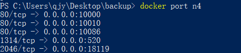
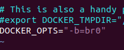
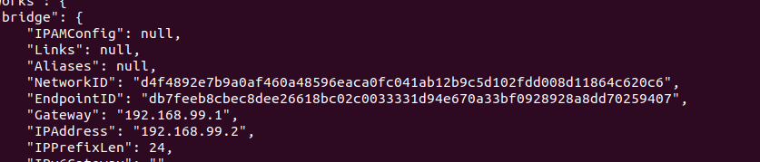

# 一 端口映射

​	默认情况下，容器和宿主机之间网络是隔离的，我们可以通过端口映射的方式，将容器中的端口，映射到宿主机的 某个端口上。这样我们就可以通过宿主机的ip+port的方式来访问容器里的内容

## 1.随机映射 -P

```
docker run -dit -P nginx
```


## 2.指定映射 -p 

(宿主机ip:宿主机端口):容器端口  **括号可省略,生产环境不推荐随机映射**

随机:

```
docker run -dit -p 127.0.0.1::80 --name n2 nginx
```

指定:

```
 docker run -dit -p 127.0.0.1:10240:80 --name n3 nginx
```

多端口映射:

```
docker run -dit -p 10086:80 -p 10010:80 -p 10000:80 -p 520:1314 -p 18119:2046 --name n4 nginx
```


# 二 网络命令

```
docker network ls
```

```
docker network inspect bridge
```

查看端口映射

```
docker port n4
```



# 三 网络模式

​	从1.7.0版本开始，Docker正式把网络跟存储这两个部分的功能实现都以插件化的形式剥离出来，允许用户通过指令来选择不同的后端实现。这也就是Docker希望构建围绕着容器的强大生态系统的一些积极尝试。 剥离出来的独 立网络项目叫做libnetwork，libnetwork中的网络模型（Container Networking Model ，CNM）十分简洁，可以 让上层的大量应用容器最大程度上不去关心底层实现。 

## 1 bridge

​	简单来说：就是穿马甲，打着宿主机的旗号，做自己的事情。 Docker的默认模式，它会在docker容 器启动时候，自动配置好自己的网络信息，同一宿主机的所有容器都在一个网络下，彼此间可以通信。类似于我们 vmware虚拟机的桥接模式。 利用宿主机的网卡进行通信，因为涉及到网络转换，所以会造成资源消耗，网络效率会低。


## 2 host

​	简单来说，就是鸠占鹊巢，用着宿主机的东西，干自己的事情。容器使用宿主机的ip地址进行通信。 特点：容器和宿主机共享网络


## 3 container

​	新创建的容器间使用，使用已创建的容器网络，类似一个局域网。 特点：容器和容器共享网络 


## 4 none

​	这种模式最纯粹，不会帮你做任何网络的配置，可以最大限度的定制化。不提供网络服务，容器启动 后无网络连接。


## 5 overlay

 	容器彼此不再同一网络，而且能互相通行。 


# 四 定制bridge 

## 1 定制1	

​	在端口映射的部分就是bridge模式的简单演示了，因为他们使用的是默认bridge网络模式，现在我们来自定义桥接网络。 

1. 创建桥接网络 
2. 使用自定义网络创建容器 
3. 容器断开、连接网络


```
docker network create --driver bridge bridge-test1
```

```
 docker network create --driver bridge --gateway 172.99.0.1 --subnet 172.99.0.0/16 bridge-test2
 --gateway strings IPv4 or IPv6 Gateway for the master subnet
主子网的IPv4或IPv6网关。
--subnet strings Subnet in CIDR format that represents a network segment
表示网络段的CIDR格式的子网。
```

- `--driver bridge`：指定要使用的网络驱动程序，这里是桥接驱动程序。桥接驱动程序是Docker容器的默认网络驱动程序，它创建一个内部网络，允许容器相互通信。
- `--gateway 172.99.0.1`：设置桥接网络的网关IP地址。网关是网络的访问点，通常是子网中的第一个可用地址。
- `--subnet 172.99.0.0/16`：定义桥接网络的子网。在这种情况下，它是172.99.0.0，子网掩码为16位，这意味着网络最多可以有2^16（65536）个地址。
- `bridge-test2`：指定网络的名称，这里是"bridge-test2"。

因此，这个Docker命令创建了一个名为"bridge-test2"的桥接网络，具有指定的网关IP地址（172.99.0.1）和子网（172.99.0.0/16）。这个网络可用于连接并启用运行在同一主机上的Docker容器之间的通信。

```
docker run --net=bridge-test1 -dit --name n1 nginx
```

断开网络

```
 docker network disconnect bridge-test1 n1
```

连接

```
docker network connect bridge-test1 n2
```

## 2 定制2

之前我们创建的容器，它们的ip都是从docker0自动获取的，接下来我们自己定义一个br0网桥，然后启动的容器就用这个 

网桥是什么？ 他是一种设备，根据设备的物理地址来划分网段，并传输数据的，docker0就是默认的网桥。 

需求： 定制docker网桥 

分析： 1、网桥的创建

2、docker服务使用新网桥 

3、测试


添加网桥

```
brctl addbr br0
```

设置网桥

```
sudo ifconfig br0 192.168.99.1 netmask 255.255.255.0
```



systemctl使用docker文件

```
#创建服务依赖文件
:~$ sudo mkdir -p /etc/systemd/system/docker.service.d
:~$ sudo vim /etc/systemd/system/docker.service.d/Using_Environment_File.conf
#内容如下：
[Service]
EnvironmentFile=-/etc/default/docker
ExecStart=
ExecStart=/usr/bin/dockerd -H fd:// $DOCKER_OPTS
#重载服务配置文件
:~$ systemctl daemon-reload
```




备份本机源文件

```
sudo cp /etc/network/interfaces /etc/network/interfaces-old
sudo vim /etc/network/interfaces
#与源文件内容进行1行的空行
auto br0
iface br0 inet static 
address 192.168.110.14
netmask 255.255.255.0
gateway 192.168.110.2
dns-nameservers 192.168.110.2 
bridge_ports ens33
```

重启网络

```
service networking restart
```

配置

```
sudo vim /etc/default/docker
```


# 五 host

```
docker run -dit --net=host --name n3 nginx
```

inspect中没有ip


# 六 none

```
docker run --net=none -itd --name [容器名称] 镜像名称
```

