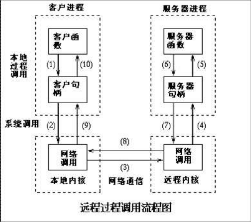

# 一 RPC

RPC（Remote Procedure Call Protocol）——远程过程调用协议，它是一种通过网络从远程计算机程序上请求 服务，而不需要了解底层网络技术的协议。简单来说，就是跟远程访问或者web请求差不多，都是一个client向远端服务器请求服务返回结果，但是web请求使用的网络协议是http高层协议，而rpc所使用的协议多为TCP，是网络层协议，减少了信息的包装，加快了处理速度。golang本身有rpc包，可以方便的使用，来构建自己的rpc服务

## 1 RPC比较HTTP

比较RPC（远程过程调用）和HTTP（超文本传输协议），它们分别用于不同的通信场景，而不一定是"好"或"坏"的关系。它们有各自的优势和用途。

1. **电话对比信件：** 想象你需要和朋友沟通，HTTP就像你通过写信（发HTTP请求）给朋友，然后等待朋友回信。而RPC就像你直接打电话（发起RPC调用）给朋友，实时交流。
2. **直接对比间接：** 使用RPC时，通信双方可以直接交流，就像直接对话一样，而HTTP更类似于通过一个中介（服务器）传递信息，有一定的延迟。
3. **实时性对比非实时性：** RPC通常更注重实时性，适用于需要快速响应的场景，就像实时聊天一样。而HTTP则更适用于请求-响应模式，可能有一些延迟，适用于传输静态资源等场景。
4. **直接调用对比间接调用：** 在RPC中，客户端可以像调用本地函数一样直接调用远程服务，而HTTP通常需要通过URL和请求方式来间接调用。

## 2 案例

1.调用客户端句柄；执行传送参数 2.调用本地系统内核发送网络消息 3.消息传送到远程主机 4.服务器句柄得到消息 并取得参数 5.执行远程过程 6.执行的过程将结果返回服务器句柄 7.服务器句柄返回结果，调用远程系统内核 8.消 息传回本地主机 9.客户句柄由内核接收消息 10.客户接收句柄返回的数据

# 二 GRPC

​	在 gRPC里客户端应用可以像调用本地对象一样直接调用另一台不同的机器上服务端应用的方法，使得您能够更容 易地创建分布式应用和服务。与许多 RPC系统类似， gRPC也是基于以下理念： 定义一个服务，指定其能够被远程调用的方法（包含参数和返回类型）。 在服务端实现这个接口，并运行一个 gRPC服务器来处理客户端调用。 在客户端拥有一个存根能够像服务端一样的方法。 gRPC客户端和服务端可以在多种环境中运行和交互 -从 google 内部的服务器到你自己的笔记本，并且可以用任何 gRPC支持的语言 来编写。 所以，你可以很容易地用 Java创建一个 gRPC服务端，用 Go、 Python、Ruby来创建客户端。此外， Google最新 API将有 gRPC版本的接口，使你很容易地将 Google的功能集成到你的应用里。

## 1 介绍

gRPC（gRPC Remote Procedure Call）是一种开源的远程过程调用（RPC）框架，由Google开发并在2015年对外发布。它基于HTTP/2协议，使用Protocol Buffers作为接口描述语言，具有高效、轻量级、跨语言等特点，被广泛应用于分布式系统中。

以下是一些介绍 gRPC 的关键特点：

1. **高效的通信：** gRPC 使用基于HTTP/2的协议，支持双向流、头部压缩等特性，从而提供了更高效的网络通信。它允许多个调用同时复用一个连接，减少了网络开销。
2. **接口描述语言：** gRPC 使用 Protocol Buffers 作为接口描述语言，这是一种轻量级、高效的二进制序列化工具。通过定义接口，可以方便地生成客户端和服务器端的代码，同时提供了强类型的数据传输。
3. **多语言支持：** gRPC 支持多种编程语言，包括但不限于Java、C++、Python、Go、C#等。这使得不同语言的服务可以无缝地进行通信，为构建分布式系统提供了更大的灵活性。
4. **跨平台：** 由于 gRPC 是跨语言的，它可以在不同的操作系统上运行，包括Windows、Linux和macOS。这使得开发人员可以选择最适合其需求的平台。
5. **支持多种调用类型：** gRPC 支持四种类型的调用，包括单一请求-单一响应、单一请求-流式响应、流式请求-单一响应以及流式请求-流式响应。这种多样性的调用类型使得 gRPC 可以适应不同的应用场景。
6. **安全性：** gRPC 提供了基于TLS/SSL的安全通信，确保数据在传输过程中的机密性和完整性。此外，它还支持各种身份验证机制，如基于令牌的身份验证

