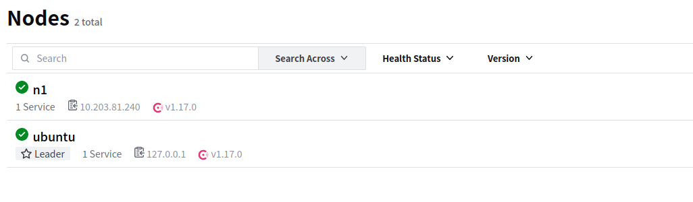
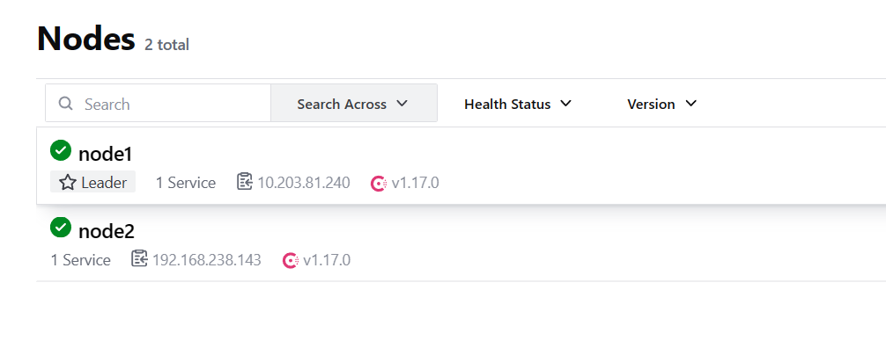

# 一 介绍

​	Consul是HashiCorp公司推出的开源工具，用于实现分布式系统的服务发现与配置。 Consul是分布式的、高可用 的、可横向扩展的。它具备以下特性 :service discovery：consul通过DNS或者HTTP接口使服务注册和服务发现变的很容易，一些外部服务，例如saas 提供的也可以一样注册。 

health checking：健康检测使consul可以快速的告警在集群中的操作。和服务发现的集成，可以防止服务转发到 故障的服务上面。 

key/value storage：一个用来存储动态配置的系统。提供简单的HTTP接口，可以在任何地方操作。 

multi-datacenter：无需复杂的配置，即可支持任意数量的区域。

##  1 特点

以下是 Consul 的一些关键特点：

1. **服务发现：** Consul 允许服务在启动和关闭时自动注册和注销。通过 Consul，服务可以通过人类可读的名称而不是 IP 地址进行标识，从而使得服务之间的通信更加简单和可维护。
2. **健康检查：** Consul 提供了健康检查机制，能够定期检查服务的状态。如果服务不健康，Consul 将自动将其标记为不可用，防止其他服务向其发起请求。
3. **KV 存储：** Consul 提供了一个分布式的键值存储（Key/Value store），可以用于存储配置、特征标志等信息。这使得动态配置变得简单，服务可以在运行时获取配置信息而无需重新启动。
4. **多数据中心支持：** Consul 支持多数据中心部署，允许在不同的地理位置运行多个 Consul 集群。这为构建全球分布式系统提供了便利。
5. **一致性协议：** Consul 使用基于 Raft 协议的一致性算法来确保数据的一致性和可靠性。Raft 协议提供了强一致性保证，保证了 Consul 的可用性和可靠性。
6. **DNS 和 HTTP 接口：** Consul 提供了 DNS 接口，使得服务可以通过域名进行发现。此外，Consul 还提供了 HTTP API，可以通过 RESTful 接口进行查询和操作。
7. **可插拔性：** Consul 是可插拔的，允许用户使用自定义插件来扩展其功能。这使得 Consul 可以适应不同的需求和环境。

##  2 安装

```
https://developer.hashicorp.com/consul/install
```

## 3 consul角色

​	client: 客户端, 无状态, 将 HTTP 和 DNS 接口请求转发给局域网内的服务端集群. server: 服务端, 保存配置信息, 高 可用集群, 在局域网内与本地客户端通讯, 通过广域网与其他数据中心通讯. 每个数据中心的 server 数量推荐为 3 个 或是 5 个

## 4 运行 Consul代理 

​	Consul是典型的 C/S架构，可以运行服务模式或客户模式。每一个数据中心必须有至少一个服务节点， 3到5个服 务节点最好。非常不建议只运行一个服务节点，因为在节点失效的情况下数据有极大的丢失风险。 

## 5 运行Agent 

​	完成Consul的安装后,必须运行agent. agent可以运行为server或client模式.每个数据中心至少必须拥有一台server  建议在一个集群中有3或者5个server部署单一的server,在出现失败时会不可避免的造成数据丢失. 

其他的agent运行为client模式.一个client是一个非常轻量级的进程.用于注册服务,运行健康检查和转发对server的 

查询.agent必须在集群中的每个主机上运行

Consul 的 Agent 是 Consul 的核心组件之一，是一个在每个运行 Consul 的节点上运行的代理进程。Agent 负责执行实际的 Consul 任务，包括服务发现、健康检查、KV 存储、事件通知等功能。每个节点上都运行一个 Consul Agent，它们协同工作以构建和维护整个分布式系统的状态。

Consul Agent 的主要职责包括：

1. **服务注册和发现：** Agent 负责将服务实例的信息注册到 Consul，并定期向 Consul 发送心跳以保持服务的可用性。其他服务可以查询 Consul Agent 以发现可用的服务实例。
2. **健康检查：** Agent 定期执行健康检查，确保服务实例的状态是健康的。如果服务实例变得不健康，Agent 会向 Consul 报告，并更新服务的状态，使其他服务在发现服务时能够避免不健康的实例。
3. **KV 存储：** Agent 管理本地的 Key/Value 存储，允许服务在运行时获取配置信息、特征标志等。这个本地存储是 Consul 提供的分布式 KV 存储的一部分。
4. **成员管理：** Agent 负责维护 Consul 集群的成员列表，以确保集群中的所有节点都能够互相发现。
5. **LAN 和 WAN 通信：** Agent 负责与同一数据中心内（LAN）的其他节点通信，以及与不同数据中心（WAN）的节点进行通信。这有助于支持 Consul 的多数据中心功能。
6. **DNS 和 HTTP API：** Agent 提供了 DNS 接口和 HTTP API，使得服务可以通过域名或 RESTful 接口进行查询和操作。
7. **事件通知：** Agent 可以发布和订阅事件，以便在系统中发生变化时通知感兴趣的服务。

## 6 命令

1. **consul agent：**
   - **解析：** 启动 Consul Agent。
   - **示例：** `consul agent -dev`，启动一个开发模式的 Consul Agent，用于本地测试。
2. **consul members：**
   - **解析：** 显示 Consul 集群中的成员列表。
   - **示例：** `consul members`，列出当前 Consul 集群中的成员信息。
3. **consul services：**
   - **解析：** 显示已注册的服务列表。
   - **示例：** `consul services`，列出当前注册在 Consul 中的服务。
4. **consul catalog nodes：**
   - **解析：** 显示节点的目录信息。
   - **示例：** `consul catalog nodes`，列出当前 Consul 集群中的所有节点。
5. **consul health：**
   - **解析：** 显示节点和服务的健康状况。
   - **示例：** `consul health service -service=web`，显示名为 "web" 的服务的健康状态。
6. **consul kv：**
   - **解析：** 用于与 Consul 的 Key/Value 存储交互。
   - **示例：** `consul kv get config/app`，获取键为 "config/app" 的值。
7. **consul event：**
   - **解析：** 用于发布和监听事件。
   - **示例：** `consul event -name deploy -payload '{"version": "1.0"}'`，发布名为 "deploy" 的事件。
8. **consul info：**
   - **解析：** 显示 Consul Agent 的信息。
   - **示例：** `consul info`，获取 Consul Agent 的运行信息。
9. **consul leave：**
   - **解析：** 使 Consul Agent 离开集群。
   - **示例：** `consul leave`，使当前节点离开 Consul 集群。

- **解析：** 创建一个用于监视 Consul 事件的 watcher。
- **示例：** `consul watch -type=service -service=web -passingonly=true`，创建一个监视 "web" 服务健康状态的 watcher。

1. **consul lock：**

- **解析：** 创建一个分布式锁。
- **示例：** `consul lock -n=my-lock /path/to/my/script.sh`，创建一个名为 "my-lock" 的分布式锁，运行指定的脚本。

1. **consul exec：**

- **解析：** 在 Consul 集群中的节点上执行命令。
- **示例：** `consul exec -node=node1 'nginx -s reload'`，在名为 "node1" 的节点上重新加载 Nginx 服务。

1. **consul acl：**

- **解析：** 用于管理 Consul Access Control Lists (ACL)。
- **示例：** `consul acl policy create -name=my-policy -description="My ACL Policy"`，创建一个名为 "my-policy" 的 ACL 策略。

1. **consul connect：**

- **解析：** 用于管理 Consul Connect，即服务间的安全通信。
- **示例：** `consul connect proxy -sidecar-for=web`，为名为 "web" 的服务创建一个 Connect Sidecar Proxy。

1. **consul snapshot：**

- **解析：** 用于创建和恢复 Consul 快照。
- **示例：** `consul snapshot save /path/to/backup.snap`，创建一个 Consul 快照并保存到指定路径。

## 7 consul集群搭建

```
#node1:
$ consul agent -server -bootstrap-expect 2 -data-dir /tmp/consul -node=n1 -
bind=192.168.110.123 -ui -config-dir /etc/consul.d -rejoin -join 192.168.110.123 -
client 0.0.0.0
#运行cosnul agent以server模式
-server ： 定义agent运行在server模式
-bootstrap-expect ：在一个datacenter中期望提供的server节点数目，当该值提供的时候，consul一直
等到达到指定sever数目的时候才会引导整个集群，该标记不能和bootstrap共用
-data-dir：提供一个目录用来存放agent的状态，所有的agent允许都需要该目录，该目录必须是稳定的，系统
重启后都继续存在
-node：节点在集群中的名称，在一个集群中必须是唯一的，默认是该节点的主机名
-bind：该地址用来在集群内部的通讯，集群内的所有节点到地址都必须是可达的，默认是0.0.0.0
-ui： 启动web界面
-config-dir：：配置文件目录，里面所有以.json结尾的文件都会被加载
-rejoin：使consul忽略先前的离开，在再次启动后仍旧尝试加入集群中。
-client：consul服务侦听地址，这个地址提供HTTP、DNS、RPC等服务，默认是127.0.0.1所以不对外提供服
务，如果你要对外提供服务改成0.0.0.0
```

```
#node2:
$ consul agent -server -bootstrap-expect 2 -data-dir /tmp/consul -node=n2 -
bind=192.168.110.148 -ui -rejoin -join 192.168.110.123
-server ： 定义agent运行在server模式
-bootstrap-expect ：在一个datacenter中期望提供的server节点数目，当该值提供的时候，consul一直
等到达到指定sever数目的时候才会引导整个集群，该标记不能和bootstrap共用
-bind：该地址用来在集群内部的通讯，集群内的所有节点到地址都必须是可达的，默认是0.0.0.0
-node：节点在集群中的名称，在一个集群中必须是唯一的，默认是该节点的主机名
-ui： 启动web界面
-rejoin：使consul忽略先前的离开，在再次启动后仍旧尝试加入集群中。
-config-dir：：配置文件目录，里面所有以.json结尾的文件都会被加载
-client：consul服务侦听地址，这个地址提供HTTP、DNS、RPC等服务，默认是127.0.0.1所以不对外提供服
务，如果你要对外提供服务改成0.0.0.0
-join 192.168.110.121 ： 启动时加入这个集群
```

```
#node3：
$ consul agent -data-dir /tmp/consul -node=n3 -bind=192.168.110.124 -config-dir
/etc/consul.d -rejoin -join 192.168.110.123
运行cosnul agent以client模式，-join 加入到已有的集群中去。
```




node1:

```
consul.exe agent -server -bootstrap-expect 2 -data-dir D:/ -node=node1 -bind=<本机ip> -ui -client 0.0.0.0
```

node2

```
consul agent -server -data-dir /tmp/consul -node=node2 -bind=<本机ip> -ui -rejoin -join <集群某个节点ip> -client 0.0.0.0
```




