# 一 查询结构

SELECT 

​	字段列表 

FROM 

​	表名列表 

WHERE 

​	条件列表 

GROUP BY 

​	分组字段列表 

HAVING 

​	分组后条件列表 

ORDER BY 

​	排序字段列表 

LIMIT 

​	分页参数  ;


# 二 聚合函数

count  	统计数量 

max 	 最大值 

min  	最小值 

avg 		平均值 

sum  	求和

 **NULL 值是不参与所有聚合函数运算的**

 **where与having区别** 

执行时机不同：where是分组之前进行过滤，不满足where条件，不参与分组；而having是分组 

之后对结果进行过滤。 

判断条件不同：where不能对聚合函数进行判断，而having可以。 

# 三 执行顺序

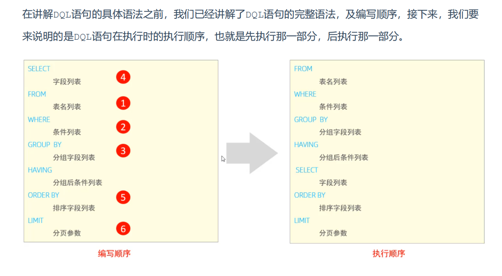

# 四 DCL

# 五 函数

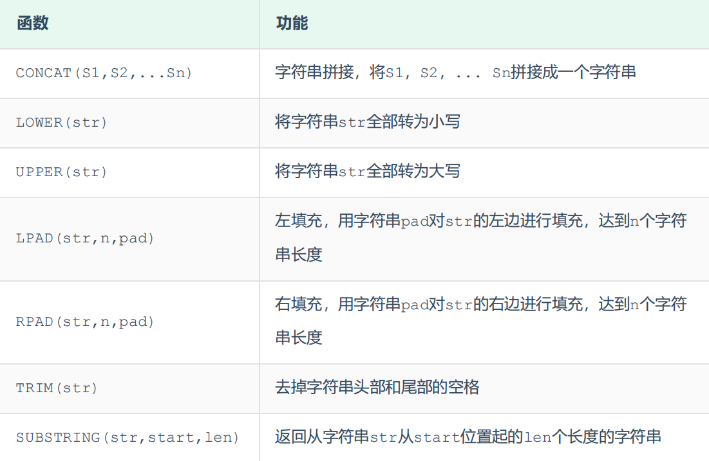


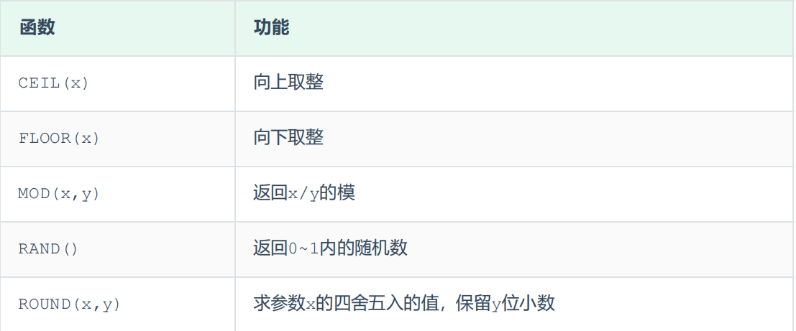

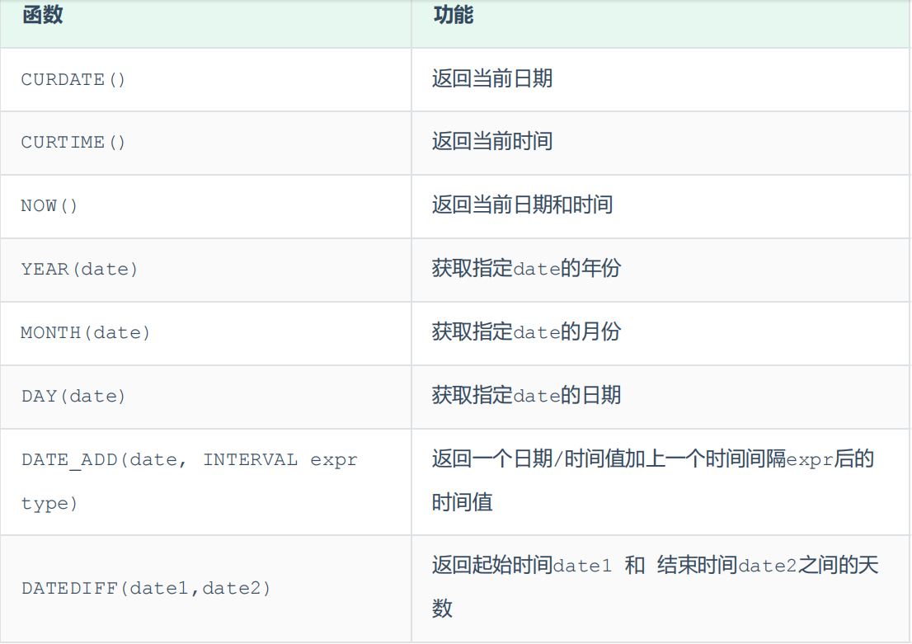

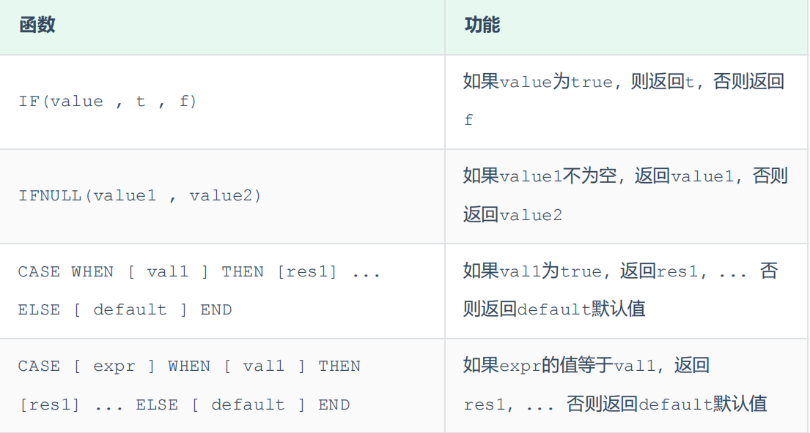

# 六 约束

```
[CONSTRAINT] [外键名称] FOREIGN KEY (外键字段名) REFERENCES 主表 (主表列名)
```

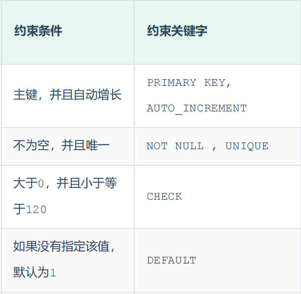

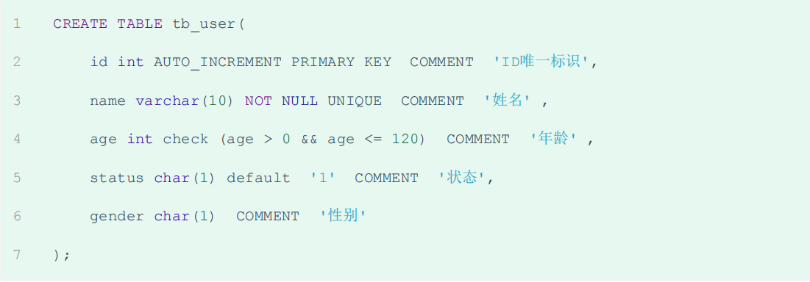

## 删除/更新行为

​	添加了外键之后，再删除父表数据时产生的约束行为，我们就称为删除/更新行为。具体的删除/更新行 

为有以下几种: 

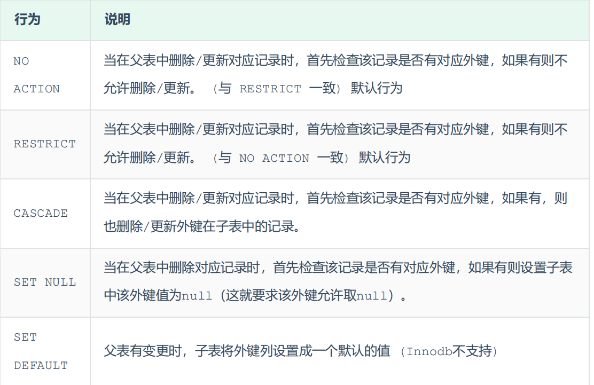

**CASCADE**


```
alter table emp add constraint fk_emp_dept_id foreign key (dept_id) references
dept(id) on update cascade on delete cascade ;
```

 **SET NULL**

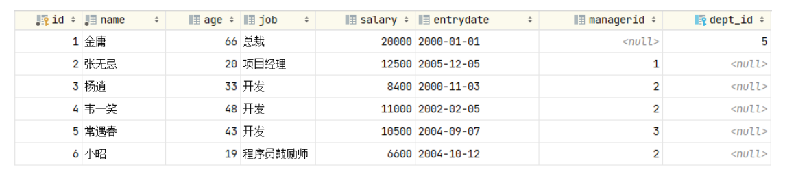

# 七 多表

## 一对多

案例: 部门 与 员工的关系 

关系: 一个部门对应多个员工，一个员工对应一个部门 

实现: 在多的一方建立外键，指向一的一方的主键

  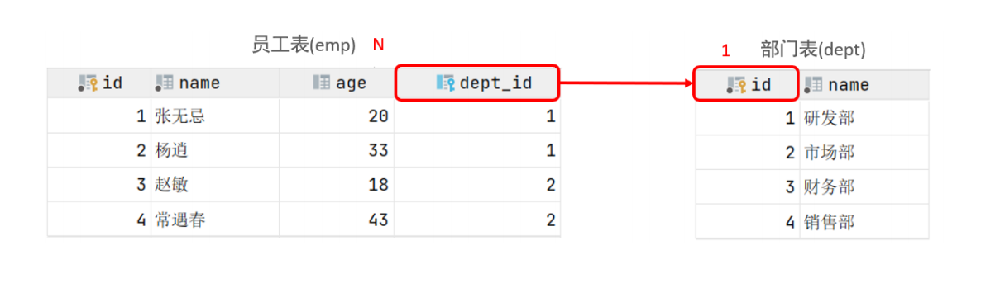

## 多对多

案例: 学生 与 课程的关系 

关系: 一个学生可以选修多门课程，一门课程也可以供多个学生选择 

实现: 建立第三张中间表，中间表至少包含两个外键，分别关联两方主键

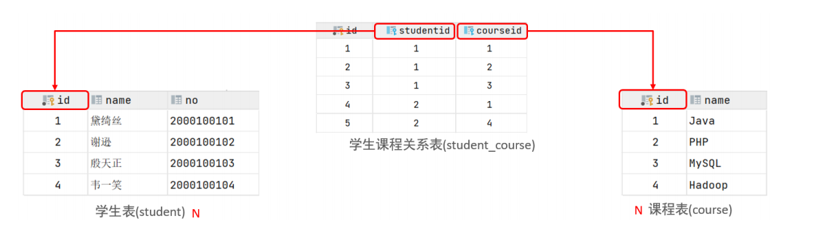

## 一对一

案例: 用户 与 用户详情的关系 

关系: 一对一关系，多用于单表拆分，将一张表的基础字段放在一张表中，其他详情字段放在另 

一张表中，以提升操作效率 

实现: 在任意一方加入外键，关联另外一方的主键，并且设置外键为唯一的(UNIQUE)

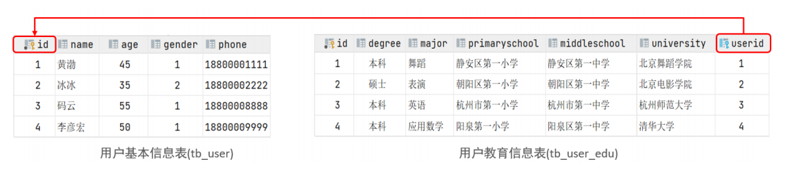