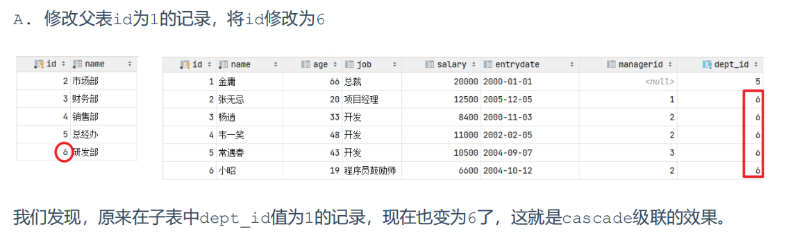
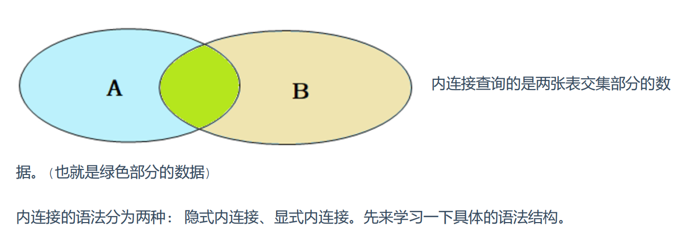
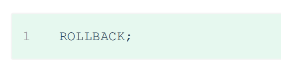
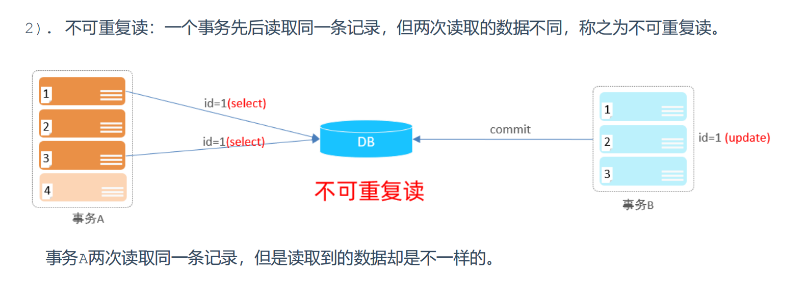
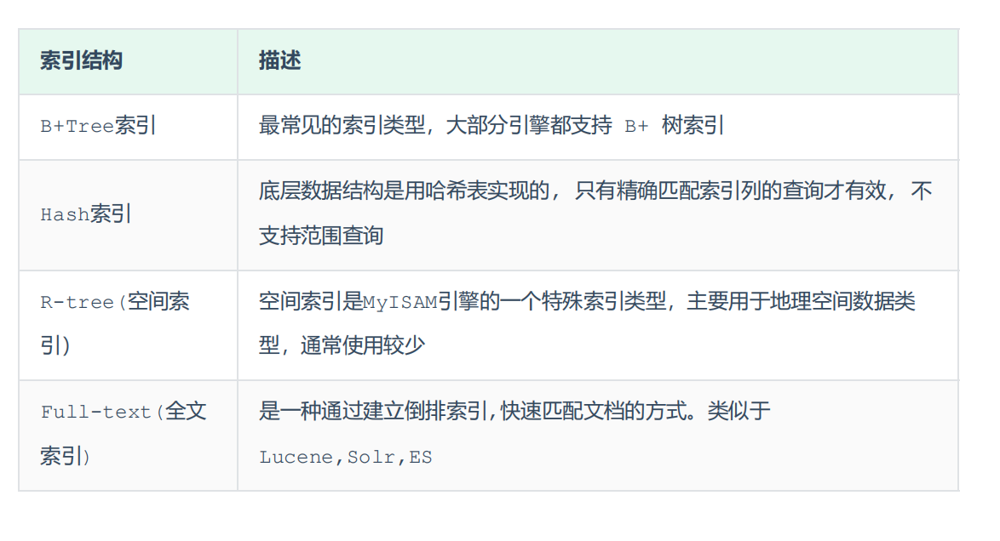
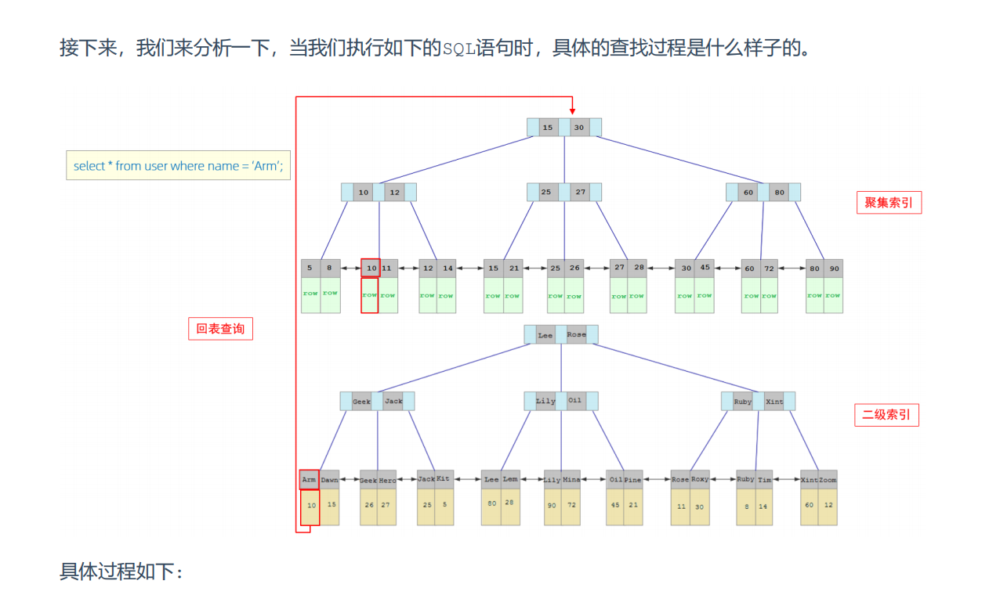

# 一 查询结构

SELECT 

​	字段列表 

FROM 

​	表名列表 

WHERE 

​	条件列表 

GROUP BY 

​	分组字段列表 

HAVING 

​	分组后条件列表 

ORDER BY 

​	排序字段列表 

LIMIT 

​	分页参数  ;


# 二 聚合函数

count  	统计数量 

max 	 最大值 

min  	最小值 

avg 		平均值 

sum  	求和

 **NULL 值是不参与所有聚合函数运算的**

 **where与having区别** 

执行时机不同：where是分组之前进行过滤，不满足where条件，不参与分组；而having是分组 

之后对结果进行过滤。 

判断条件不同：where不能对聚合函数进行判断，而having可以。 

# 三 执行顺序


# 四 DCL

# 五 函数


# 六 约束

```
[CONSTRAINT] [外键名称] FOREIGN KEY (外键字段名) REFERENCES 主表 (主表列名)
```


## 删除/更新行为

​	添加了外键之后，再删除父表数据时产生的约束行为，我们就称为删除/更新行为。具体的删除/更新行 

为有以下几种: 


**CASCADE**



```
alter table emp add constraint fk_emp_dept_id foreign key (dept_id) references
dept(id) on update cascade on delete cascade ;
```

 **SET NULL**


# 七 多表

## 一对多

案例: 部门 与 员工的关系 

关系: 一个部门对应多个员工，一个员工对应一个部门 

实现: 在多的一方建立外键，指向一的一方的主键

  

## 多对多

案例: 学生 与 课程的关系 

关系: 一个学生可以选修多门课程，一门课程也可以供多个学生选择 

实现: 建立第三张中间表，中间表至少包含两个外键，分别关联两方主键


## 一对一

案例: 用户 与 用户详情的关系 

关系: 一对一关系，多用于单表拆分，将一张表的基础字段放在一张表中，其他详情字段放在另 

一张表中，以提升操作效率 

实现: 在任意一方加入外键，关联另外一方的主键，并且设置外键为唯一的(UNIQUE)


## 查询

**连接查询** 

内连接：相当于查询A、B交集部分数据 

外连接： 

左外连接：查询左表所有数据，以及两张表交集部分数据 

右外连接：查询右表所有数据，以及两张表交集部分数据 

自连接：当前表与自身的连接查询，自连接必须使用表别名 

**子查询**


**内连接**



## 联合查询

union all查询出来的结果，仅仅进行简单的合并，并未去重

union 联合查询，会对查询出来的结果进行去重处理


# 八 子查询

A. 标量子查询（子查询结果为单个值） 

B. 列子查询(子查询结果为一列) 

C. 行子查询(子查询结果为一行) 

D. 表子查询(子查询结果为多行多列)

根据子查询位置，分为： 

A. WHERE之后 

B. FROM之后 

C. SELECT之后

## 标量子查询

子查询返回的结果是单个值（数字、字符串、日期等），最简单的形式，这种子查询称为标量子查询。 

常用的操作符：= <> > >= < <=  

## 列子查询

子查询返回的结果是一列（可以是多行），这种子查询称为列子查询。 

常用的操作符：IN 、NOT IN 、 ANY 、SOME 、 ALL 


## 行子查询

子查询返回的结果是一行（可以是多列），这种子查询称为行子查询。 

常用的操作符：= 、<> 、IN 、NOT IN

   查询与 "张无忌" 的薪资及直属领导相同的员工信息

```
select * from emp where (salary,managerid)=(select salary,managerid from emp where name='张无忌');
```

## 表子查询

子查询返回的结果是多行多列，这种子查询称为表子查询。 

常用的操作符：IN 

# 九 事务

事务 是一组操作的集合，它是一个不可分割的工作单位，事务会把所有的操作作为一个整体一起向系 

统提交或撤销操作请求，即这些操作要么同时成功，要么同时失败。 




## 特性

原子性（Atomicity）：事务是不可分割的最小操作单元，要么全部成功，要么全部失败。 

一致性（Consistency）：事务完成时，必须使所有的数据都保持一致状态。 

隔离性（Isolation）：数据库系统提供的隔离机制，保证事务在不受外部并发操作影响的独立 

环境下运行。 

持久性（Durability）：事务一旦提交或回滚，它对数据库中的数据的改变就是永久的。 

上述就是事务的四大特性，简称ACID。 

## 问题





## 隔离


## 设置事务隔离级别


# 十 存储结构

表空间 : InnoDB存储引擎逻辑结构的最高层，ibd文件其实就是表空间文件，在表空间中可以 

包含多个Segment段。 

段 : 表空间是由各个段组成的， 常见的段有数据段、索引段、回滚段等。InnoDB中对于段的管 

理，都是引擎自身完成，不需要人为对其控制，一个段中包含多个区。 

区 : 区是表空间的单元结构，每个区的大小为1M。 默认情况下， InnoDB存储引擎页大小为 

16K， 即一个区中一共有64个连续的页。 

页 : 页是组成区的最小单元，页也是InnoDB 存储引擎磁盘管理的最小单元，每个页的大小默 

认为 16KB。为了保证页的连续性，InnoDB 存储引擎每次从磁盘申请 4-5 个区。 

行 : InnoDB 存储引擎是面向行的，也就是说数据是按行进行存放的，在每一行中除了定义表时 

所指定的字段以外，还包含两个隐藏字段(后面会详细介绍)。

# 十一 索引






创建索引

```
CREATE INDEX idx_user_name ON tb_user(name);

CREATE UNIQUE INDEX idx_user_phone ON tb_user(phone);

CREATE INDEX idx_user_pro_age_sta ON tb_user(profession,age,status);

CREATE INDEX idx_email ON tb_user(email);
```

# 十二 性能分析


## explain 

EXPLAIN 或者 DESC命令获取 MySQL 如何执行 SELECT 语句的信息，包括在 SELECT 语句执行 

过程中表如何连接和连接的顺序。 

```
-- 直接在select语句之前加上关键字 explain / desc
EXPLAIN SELECT 字段列表 FROM 表名 WHERE 条件 ;
```


```
SELECT * FROM tb_sku WHERE sn = '100000003145001';

create index idx_sku_sn on tb_sku(sn) ;
```

## 最左前缀法则

如果索引了多列（联合索引），要遵守最左前缀法则。最左前缀法则指的是查询从索引的最左列开始， 

并且不跳过索引中的列。如果跳跃某一列，索引将会部分失效(后面的字段索引失效)。 


```
explain select * from tb_user where profession = '软件工程' and age = 31 and status= '0';

explain select * from tb_user where profession = '软件工程';

explain select * from tb_user where status = '0';
```

最左前缀法则中指的最左边的列，是指在查询时，联合索引的最左边的字段(即是 第一个字段)必须存在，与我们编写SQL时，条件编写的先后顺序无关

## 范围查询

联合索引中，出现范围查询(>,<)，范围查询右侧的列索引失效。

```
explain select * from tb_user where profession = '软件工程' and age > 30 and status
= '0';
```


```
explain select * from tb_user where profession = '软件工程' and age > 30 and status= '0';

explain select * from tb_user where profession = '软件工程' and age >= 30 and status = '0';
```

在业务允许的情况下，尽可能的使用类似于 >= 或 <= 这类的范围查询，而避免使用 > 或 < 

#  十三 索引失效

字段进行函数运算操作之后，索引失效。

字符串类型字段使用时，不加引号，索引将失效。

如果仅仅是尾部模糊匹配，索引不会失效。如果是头部模糊匹配，索引失效。 

用or分割开的条件， 如果or前的条件中的列有索引，而后面的列中没有索引，那么涉及的索引都不会 

被用到。

# 十四 强制使用索引


# 十五 索引覆盖


# 十六 前缀索引

​	当字段类型为字符串（varchar，text，longtext等）时，有时候需要索引很长的字符串，这会让 

索引变得很大，查询时，浪费大量的磁盘IO， 影响查询效率。此时可以只将字符串的一部分前缀，建 

立索引，这样可以大大节约索引空间，从而提高索引效率。

```
create index idx_xxxx on table_name(column(n)) ;
create index idx_email_5 on tb_user(email(5)); 
```

 前缀长度 

可以根据索引的选择性来决定，而选择性是指不重复的索引值（基数）和数据表的记录总数的比值， 

索引选择性越高则查询效率越高， 唯一索引的选择性是1，这是最好的索引选择性，性能也是最好的。 

# 十七 单列索引与联合索引

单列索引：即一个索引只包含单个列

联合索引：即一个索引包含了多个列

注意回表查询

# 十八 索引设计原则


